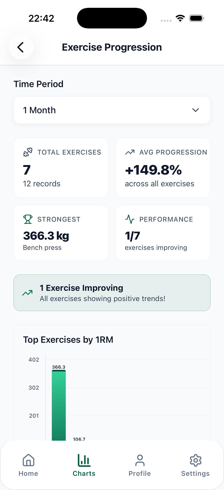
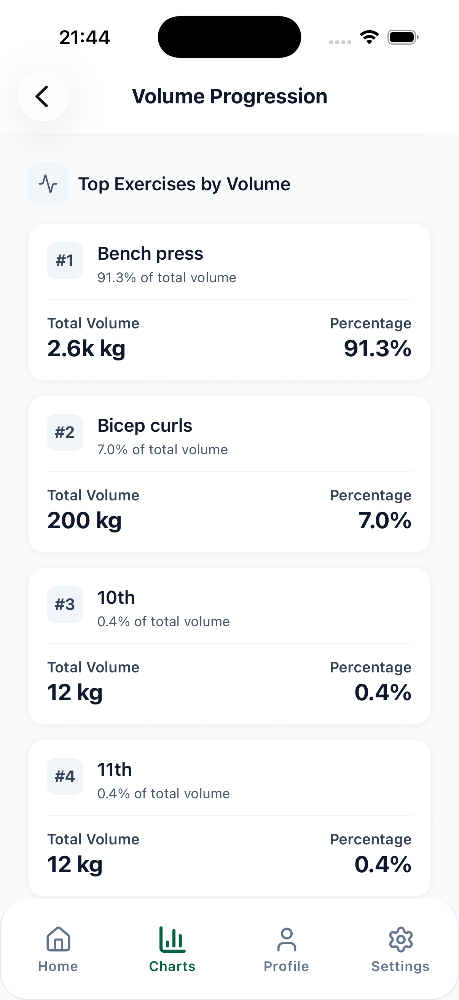
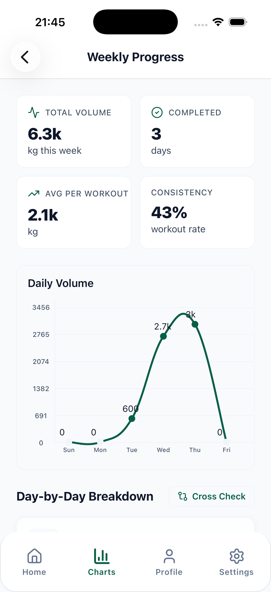
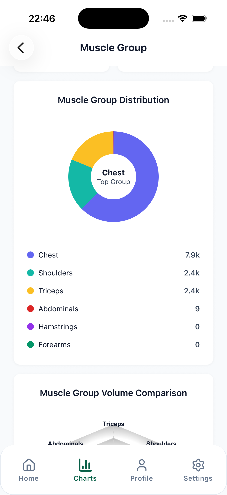
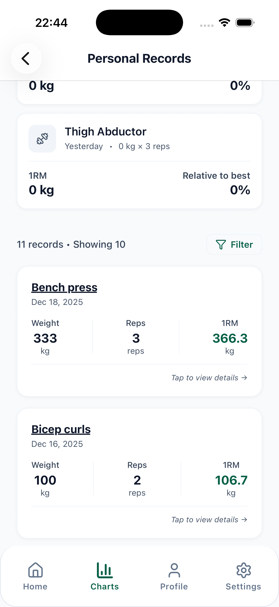
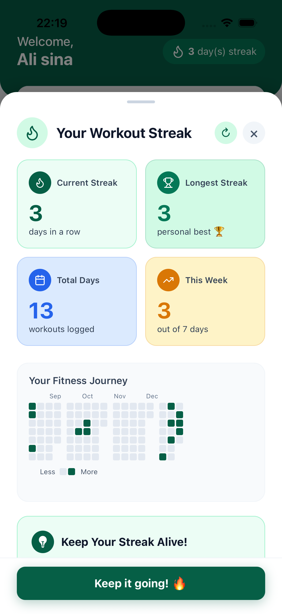
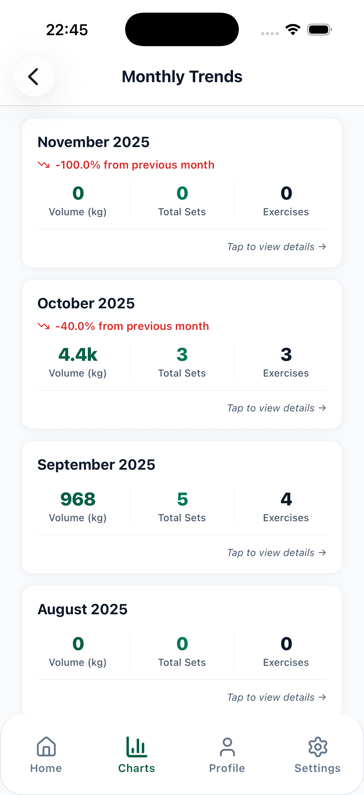

# Progressive Overloading

**Progressive overload made simple.**

Log every lift in seconds, see trends instantly, and get confident recommendations
that keep you progressing without guesswork.

---

## Screenshots

| Exercise Progression | Volume Progression | Weekly Progress |
| :---: | :---: | :---: |
|  |  |  |

| Muscle Group Heatmap | Personal Records | Workout Streak |
| :---: | :---: | :---: |
|  |  |  |

| Monthly Trends |
| :---: |
|  |

## Features

- **Exercise progression** — track estimated one-rep max improvements over time with interactive charts and spot your strongest movements.
- **Volume progression** — see cumulative weight lifted per day and analyze your training load patterns.
- **Personal records** — PRs are detected automatically and celebrated across all exercises.
- **Quick stats** — streaks, goals, total sets, and personal records at a glance.
- **Fitness goals** — set multiple objectives with progress indicators and target dates.
- **Training insights** — weekly breakdowns (sets, exercises, volume), monthly trend analysis, and a muscle group heatmap to catch imbalances.
- **Streaks & reminders** — GitHub-style activity grid, streak counters, and reminder notifications to keep you consistent.
- **AI-powered recommendations** — confident next-session suggestions *(coming soon)*.

## How it works

1. **Log your lifts** — quick entry for weight, reps, sets, and RPE, in kg or lb.
2. **See your progress** — real-time charts for 1RM, volume trends, and personal records.
3. **Get recommendations** — AI-powered suggestions for your next session *(coming soon)*.
4. **Stay consistent** — goal tracking, streak counters, and reminder notifications.

## Built with

- [Expo](https://expo.dev/) + [React Native](https://reactnative.dev/) with [Expo Router](https://docs.expo.dev/router/introduction/)
- [NativeWind](https://www.nativewind.dev/) (Tailwind CSS for React Native)
- [Supabase](https://supabase.com/) for auth and database (incl. Sign in with Apple)
- [Zustand](https://zustand-demo.pmnd.rs/) for state management
- [react-native-gifted-charts](https://github.com/Abhinandan-Kushwaha/react-native-gifted-charts) + Reanimated for charts and animations

## Links

- 🌐 Website: [progressive-overloading.com](https://progressive-overloading.com/)
- 📱 Download: [App Store](https://apps.apple.com/us/app/progressive-overloading/id6759499451) · Google Play *(coming soon)*
- 🔒 [Privacy Policy](https://progressive-overloading.com/privacy-policy)

---

© 2026 Progressive Overloading. All rights reserved.

